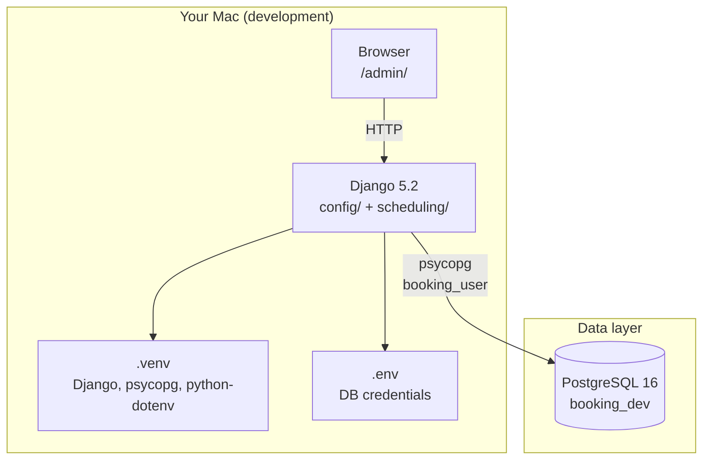
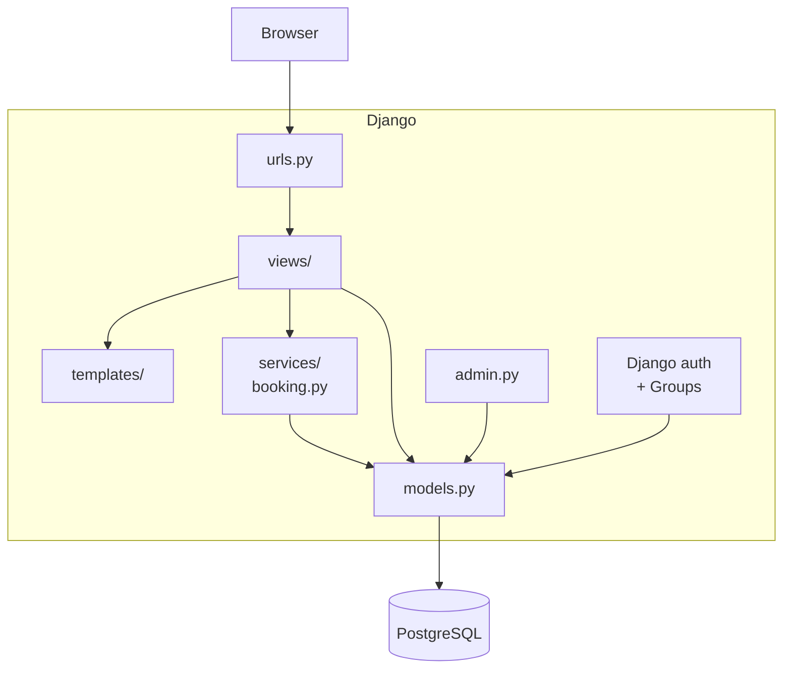
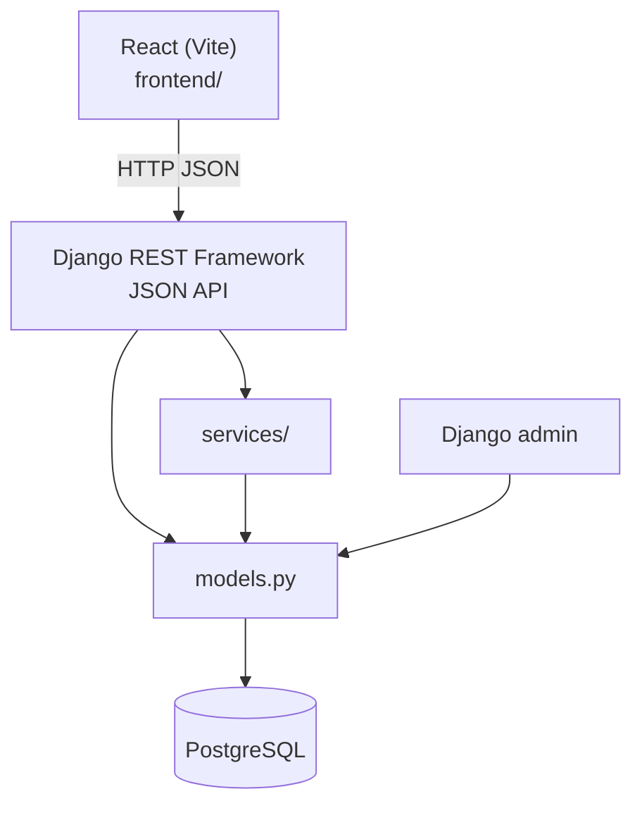
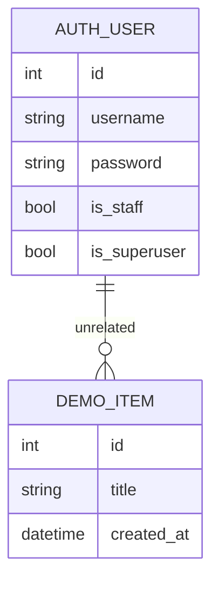
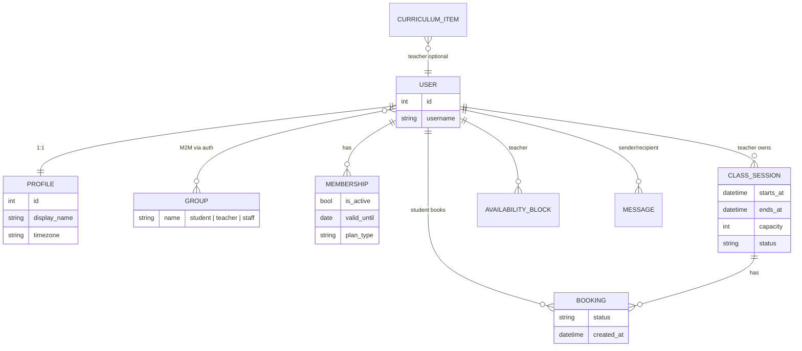
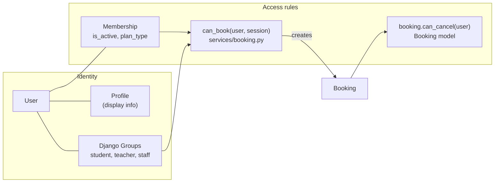
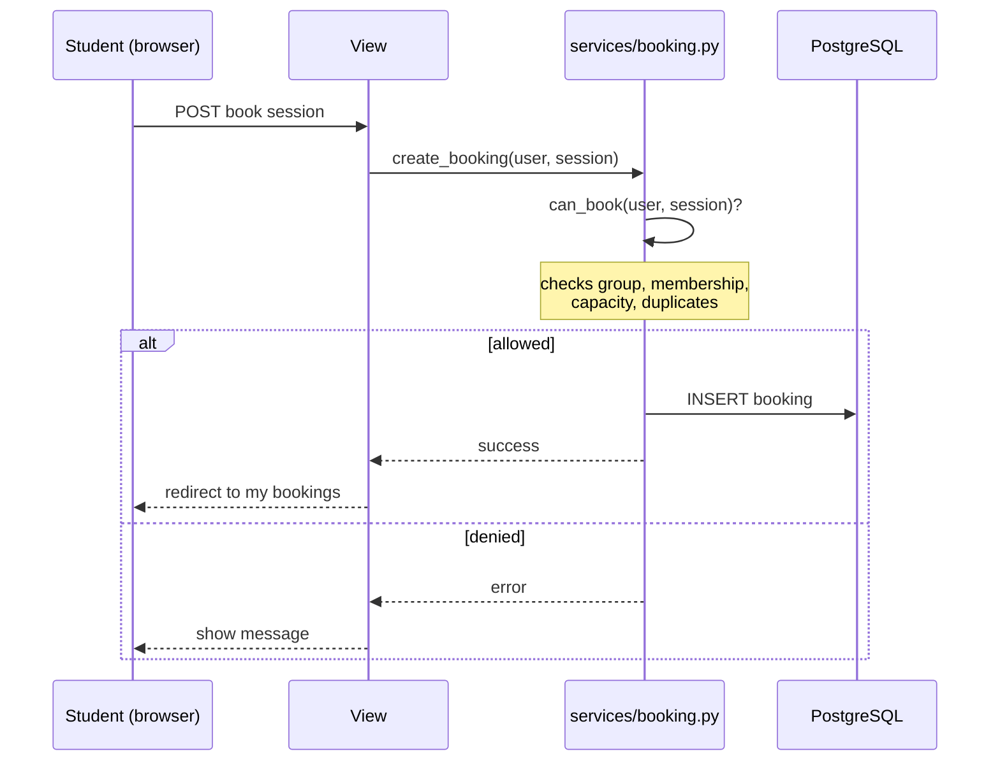

# Architecture & Roadmap

Reference for how the booking app is structured today, where it's headed, and how your design decisions fit together.

**Last updated:** 2026-06-17

---

## 1. System architecture — today (Phase 0 complete)

What actually exists and runs right now:



| Layer | What you have | Purpose |
|-------|---------------|---------|
| **Browser** | Visit `/admin/` | Django admin UI |
| **Django project** | `config/` | Settings, root URLs |
| **Django app** | `scheduling/` | Models, admin (views/templates later) |
| **Config** | `.env` + `python-dotenv` | Secrets not in code |
| **Database** | `booking_dev` on Postgres | Persistent storage |

**Not built yet:** custom views, templates, login pages, `services/`, booking models, React.

---

## 2. System architecture — target (Phase 1–4)

Template-first full stack before React:



**Rule:** Views call services. Services enforce rules. Templates only display.

---

## 3. System architecture — future (Phase 5+)

React replaces templates; domain layer stays:



**What transfers:** models, migrations, services, Groups, admin.  
**What gets replaced:** templates, Django Forms on the client.

---

## 4. Data model — today vs planned

### Today (in Postgres)



`DemoItem` is a learning placeholder. `auth_user` comes from Django's built-in auth (your superuser lives here).

### Planned (Phase 1–4)



---

## 5. Roles & permissions (your design)



| Concept | Where it lives | Notes |
|---------|----------------|-------|
| **Profile** | `Profile` model, 1:1 with `User` | Display name, timezone — not roles |
| **Roles** | Django `Group`s | User can be in multiple groups |
| **Django admin access** | `User.is_staff` / `is_superuser` | `/admin/` only — separate from app roles |
| **App staff** | `staff` Group | Business admin inside your app |
| **Membership** | `Membership` model | Gates booking by plan / active status |
| **can_book** | `services/booking.py` | Called before a `Booking` exists |
| **can_cancel** | `Booking.can_cancel(user)` | Called on an existing booking |
| **create_booking** | `services/booking.py` | Single entry point; calls all checks |

---

## 6. Booking flow (Phase 2 target)



---

## 7. Repo layout — today vs target

### Today

```text
booking_scheduling_app/
├── config/                 # project settings, urls
├── scheduling/
│   ├── models.py           # DemoItem only
│   ├── admin.py            # DemoItem registered
│   ├── views.py            # empty
│   └── migrations/
├── docs/
├── manage.py
├── requirements.txt
├── .env                    # not in git
└── .venv/                  # not in git
```

### Target (grow incrementally)

```text
booking_scheduling_app/
├── config/
├── scheduling/
│   ├── models.py           # Profile, ClassSession, Booking, ...
│   ├── views/
│   │   ├── student.py
│   │   └── teacher.py
│   ├── services/
│   │   ├── booking.py      # can_book, create_booking, cancel_booking
│   │   └── availability.py # Phase 3
│   ├── templates/
│   │   ├── base.html
│   │   ├── student/
│   │   └── teacher/
│   ├── urls.py
│   └── admin.py
├── docs/
└── frontend/               # Phase 5 only
```

`services/` does not exist yet — you create it in Phase 2 when booking logic needs a home.

---

## 8. Roadmap

### Phase 0 — Environment & mental model ✅ (almost done)

| Status | Task |
|--------|------|
| ✅ | venv, requirements, GitHub |
| ✅ | PostgreSQL + `.env` |
| ✅ | Django project + `scheduling` app |
| ✅ | Migrations + `runserver` |
| ✅ | `DemoItem` in admin |
| ✅ | Design: Groups, Profile, services pattern |
| ⬜ | Formal checkpoint review → then Phase 1 |

---

### Phase 1 — Users, roles, auth

**Goal:** Login works; student and teacher see different dashboards.

| # | You build | Learn |
|---|-----------|-------|
| 1 | `Profile` model (1:1 with `User`) | FK, signals or save hook |
| 2 | Create Groups: `student`, `teacher`, `staff` | Django auth Groups |
| 3 | Registration + login + logout | Sessions, `@login_required` |
| 4 | Role check helper (e.g. user in group?) | Authorization in views |
| 5 | Student dashboard template (stub) | Templates, URL routing |
| 6 | Teacher dashboard template (stub) | Block wrong role in view |
| 7 | Test users via admin | Groups assignment |

**Checkpoint:** Teacher cannot open student dashboard (server enforces, not just hidden link).

---

### Phase 2 — Core booking slice

**Goal:** Teacher creates session → student books → student cancels.

| # | You build | Learn |
|---|-----------|-------|
| 1 | `ClassSession` model | FK to User (teacher), UTC datetimes |
| 2 | `Booking` model | FKs, status field |
| 3 | `scheduling/services/booking.py` | Service layer pattern |
| 4 | `can_book(user, session)` | Permission logic centralized |
| 5 | `Booking.can_cancel(user)` | Model method |
| 6 | `create_booking()` | Transactions, integrity |
| 7 | Teacher: create session form | Django Forms, POST |
| 8 | Student: list sessions, book, cancel | Querysets, filters |
| 9 | Mock `Membership` gate | Boolean before book |

**Checkpoint:** Explain `create_booking()` without looking at notes.

---

### Phase 3 — Teacher availability

| # | You build |
|---|-----------|
| 1 | `AvailabilityBlock` model |
| 2 | Teacher UI to manage blocks |
| 3 | Optional: constrain session creation |

---

### Phase 4 — Messages & curriculum

| # | You build |
|---|-----------|
| 1 | `Message` model + inbox views |
| 2 | `CurriculumItem` read-only views |
| 3 | Real `Membership` rules (plan types) |

---

### Phase 5 — React + DRF

| # | You build |
|---|-----------|
| 1 | DRF + one read endpoint |
| 2 | Vite React app |
| 3 | Migrate one page at a time |
| 4 | Reuse `services/` — no duplicated rules |

---

### Phase 6 — Polish

Deploy, calendar UI, Stripe (maybe), email, tests.

---

## 9. Decisions recorded

| Topic | Decision |
|-------|----------|
| Frontend strategy | Templates first (Choice 2), React Phase 5 |
| Roles | Django Groups (`student`, `teacher`, `staff`) |
| Profile | One `Profile` per `User` — display info, not roles |
| Dual roles | Multiple groups per user (not single `role` field) |
| `can_book` | `services/booking.py` (session + user) |
| `can_cancel` | `Booking.can_cancel(user)` |
| Booking creation | `create_booking()` in services — single entry point |
| Membership | Separate model; gates features by plan/status |

---

## 10. What to read next

- [phase-0-reading.md](./phase-0-reading.md) — setup concepts
- [postgres-roles-membership-inheritance.md](./postgres-roles-membership-inheritance.md) — DB vs app terminology
- [LEARNING_PATH.md](../LEARNING_PATH.md) — checklists and checkpoints
