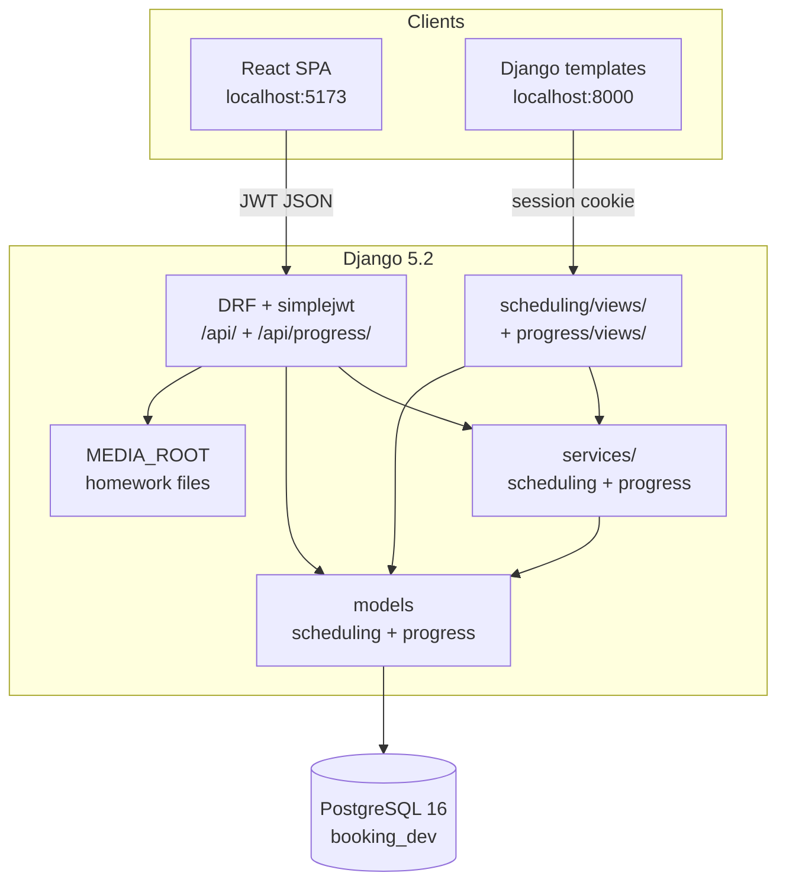
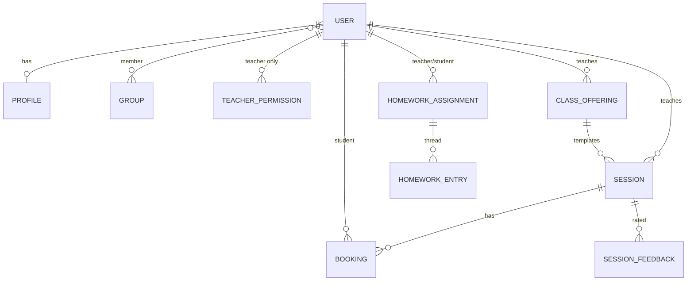

# Architecture & Roadmap

Reference for how the booking app is structured today, where it's headed, and how design decisions fit together.

**Last updated:** 2026-07-06 (post class-requests / catalog sprint)

**Deployment model:** One Postgres database and one `.env` per deployment (single-tenant). Multi-tenant SaaS is not implemented — see [`future-features.md`](./future-features.md) §10. Deploy and run: [`operations-guide.md`](./operations-guide.md).

---

## 1. System architecture — today (sandbox complete)

Dual UI on one Django project + Postgres. Business rules live in `services/`; views and DRF are thin.


```mermaid
flowchart TB
    subgraph clients["Clients"]
        React["React SPA\nlocalhost:5173"]
        HTML["Django templates\nlocalhost:8000"]
    end

    subgraph django["Django 5.2"]
        DRF["DRF + simplejwt\n/api/ + /api/progress/"]
        Views["scheduling/views/\n+ progress/views/"]
        Services["services/\nscheduling + progress"]
        Models["models\nscheduling + progress"]
        Media["MEDIA_ROOT\nhomework files"]
    end

    PG[("PostgreSQL 16\nbooking_dev")]

    React -->|"JWT JSON"| DRF
    HTML -->|"session cookie"| Views
    DRF --> Services
    Views --> Services
    Services --> Models
    DRF --> Models
    Views --> Models
    Models --> PG
    DRF --> Media
```

| Layer | Location | Purpose |
|-------|----------|---------|
| **React SPA** | `frontend/src/` | Primary UI — all role dashboards migrated |
| **DRF API** | `scheduling/api/`, `progress/api/` + `api_urls.py` | JWT auth for React |
| **HTML UI** | `scheduling/views/`, templates | Legacy/alternate UI (still works) |
| **Services** | `scheduling/services/`, `progress/services.py`, `progress/homework_services.py` | Booking, permissions, metrics, homework rules |
| **Apps** | `scheduling/`, `progress/` | Domain models and migrations |
| **Media** | `media/` (gitignored) | Homework attachments; purged after 7 days |
| **Config** | `config/settings.py`, `.env` | DRF, CORS, JWT, integrations |

**Auth:** Django Groups (`student`, `teacher`, `staff`). React uses JWT; templates use sessions.

---

## 2. Request flow

```text
React page  ──► api.js (JWT)  ──► DRF view  ──► services/  ──► models  ──► Postgres
HTML view   ──► Django view   ──► services/  ──► models  ──► Postgres
```

**Rules:**

1. Views and DRF call `services/` — never duplicate business logic in the client.
2. Templates / React = display only.
3. `POST` for writes; `GET` for lists.
4. Integrations degrade gracefully without env credentials.

---

## 3. Data model — current

### `scheduling` app

| Model | Purpose |
|-------|---------|
| `Profile` | 1:1 with `User` — display name, timezone, theme, onboarding dismiss, Stripe customer id |
| `ClassOffering` | Teacher’s teachable class (subject → level → focus → topics via `ClassTopic`) |
| `ClassType` | Legacy/simple class type (superseded by `ClassOffering` in React) |
| `CatalogSubject` / `CatalogLevel` / `CatalogFocus` / `CatalogTopic` | Staff-managed **studio roadmap** template; teachers/staff pick from it when creating offerings |
| `Session` | Scheduled slot; FK to teacher + `ClassOffering`; capacity, status, Meet URL, `google_calendar_event_id` |
| `Booking` | Student seat in a session; optional FK to originating `ClassRequest` |
| `MembershipPlan` | Studio pricing tier; subscription or ticket pack; optional `subject` or `allowed_classes` scope |
| `Membership` | Student’s active plan instance; ticket balance |
| `Payment` | Stripe checkout session tracking; webhook fulfillment |
| `AvailabilityBlock` | Weekly recurring teacher availability |
| `SpecialAvailability` | One-off availability overrides |
| `TeacherPermission` | Per-teacher capability flags (staff-controlled) |
| `StudioGlossary` | Staff-customizable UI terminology |
| `Message` | Inbox (read-only list in React) |
| `CurriculumItem` | Published curriculum content |
| `BlogPost` | Studio announcements on home page (Markdown body, optional image) |
| `ClassRequest` | Student-requested slot during availability; specific teacher or **open to any teacher**; ticket hold until approve/deny |
| `StudioBranding` | Sign-in + sidebar display name and logo (staff-editable) |
| `StudioLLMConfig` | Studio-wide LLM provider settings (staff) |
| `GoogleCredential` | OAuth tokens for teacher/staff Google Calendar + Meet |
| `DemoItem` | Learning placeholder (admin only) |

### `progress` app

| Model | Purpose |
|-------|---------|
| `SessionFeedback` | Per-session skill scores + notes (JSON `scores`) |
| `ProgressReport` | Legacy rating + note reports |
| `ScoreDimension` | Configurable metric labels (studio-wide, optional per-subject) |
| `Skill` | Optional skill tag on progress reports |
| `HomeworkAssignment` | Teacher → student file exchange or journal prompt |
| `HomeworkEntry` | Thread message; optional attachment (7-day TTL) |
| `SessionHistoryPrivacy` | Student/teacher can hide past session history from peer teachers; staff always see |

### Relationships (simplified)


```mermaid
erDiagram
  USER ||--o| PROFILE : has
  USER }o--o{ GROUP : member
  USER ||--o{ TEACHER_PERMISSION : "teacher only"
  USER ||--o{ CLASS_OFFERING : teaches
  USER ||--o{ SESSION : teaches
  CLASS_OFFERING ||--o{ SESSION : templates
  SESSION ||--o{ BOOKING : has
  USER ||--o{ BOOKING : student
  SESSION ||--o{ SESSION_FEEDBACK : rated
  USER ||--o{ HOMEWORK_ASSIGNMENT : "teacher/student"
  HOMEWORK_ASSIGNMENT ||--o{ HOMEWORK_ENTRY : thread
```

---

## 4. Roles & permissions

### Django Groups

| Group | Access |
|-------|--------|
| `student` | Book sessions, request classes, membership, progress, homework, self-registration |
| `teacher` | Own schedule/classes/availability; class request inbox; reports; homework (if permitted) |
| `staff` | Studio-wide admin: all teachers, metrics, glossary, catalog, plans, user active/inactive |

`User.is_staff` / `is_superuser` → Django `/admin/` only. App staff uses the `staff` Group.

### Teacher capabilities (`TeacherPermission`)

Staff grants or revokes per teacher:

| Key | Label |
|-----|-------|
| `manage_schedule` | Create and schedule sessions |
| `manage_classes` | Create and edit teachable classes |
| `manage_availability` | Edit weekly and special availability |
| `write_reports` | Submit session feedback |
| `assign_homework` | Send files and journal prompts |
| `manage_blog` | Publish home-page announcements and photos |
| `use_ai` | Draft session notes via studio LLM |

Service: `scheduling/services/teacher_permissions.py` — `teacher_can(user, key)`. Staff always passes.

Staff configures the LLM at **Staff → AI settings** (`StudioLLMConfig`).

### Booking & class-request gates

| Check | Where |
|-------|-------|
| `can_book` / `create_booking` | `scheduling/services/booking.py` |
| `cancel_booking` | Same |
| Membership active / plan scope | `scheduling/services/membership.py` |
| Class request create / approve / deny | `scheduling/services/class_requests.py` |
| Bookable slot options (availability − busy) | `scheduling/services/scheduling_slots.py` |

---

## 5. Repo layout

```text
booking_scheduling_app/
├── config/
│   ├── settings.py          # DRF, CORS, JWT, MEDIA, integrations
│   ├── middleware.py        # CSP (production)
│   └── urls.py              # /api/, /api/progress/, media (DEBUG)
├── scheduling/
│   ├── models.py
│   ├── services/            # booking, class_requests, scheduling_slots, class_catalog, …
│   ├── views/               # HTML dashboards (package)
│   ├── api/                 # DRF: views, serializers, staff_views, class_request_views, …
│   ├── templates/
│   └── management/commands/ # bootstrap_sandbox, purge_expired_homework
├── progress/
│   ├── models.py
│   ├── services.py          # metrics, feedback, student dashboard
│   ├── homework_services.py # file exchange + journal + purge
│   ├── api/                 # split package (dashboard, homework, feedback, history, staff)
│   ├── api_urls.py
│   ├── views/ + templates/
│   └── management/commands/ # purge_expired_homework
├── integrations/
│   ├── stripe/              # Checkout + webhooks
│   ├── llm/client.py        # OpenAI / Anthropic / Ollama HTTP client
│   └── google/              # OAuth + Calendar API Meet links
├── frontend/src/
│   ├── pages/               # role-specific React pages
│   ├── components/          # calendars, modals, HomeworkThread, MarkdownPreview, …
│   ├── hooks/               # useTeacherScope, useGlossary, useBranding, …
│   └── utils/datetime.js    # timezone + local ↔ ISO helpers
├── docs/
│   ├── architecture-and-roadmap.md   # this file
│   ├── operations-guide.md           # deploy, env, maintenance
│   ├── learn-the-app.md              # plain-English walkthrough (owner / new dev)
│   └── future-features.md            # backlog
├── media/                   # gitignored — homework + blog + branding uploads
└── .github/workflows/ci.yml # test + ruff + frontend build
```

---

## 6. Roadmap — phase status

### Sandbox & audit (complete)

| Phase | Status | Notes |
|-------|--------|-------|
| 0–6 — Environment through React SPA | ✅ | Postgres, booking, availability, DRF migration |
| 7–15 — Audit remediation | ✅ | Security, tests, CI, Ruff, media privacy — [`audit-remediation-plan.md`](./audit-remediation-plan.md) |
| 16–21 — Audit plan Part B | ✅ | Session history privacy, Stripe E2E, themes, onboarding, Google OAuth |
| 22 — Markdown preview | ✅ | `scheduling/services/markdown.py` + blog/homework preview UI |

### Post-audit product work (2026)

| Feature | Where |
|---------|-------|
| Staff studio admin | `scheduling/api/staff_views.py`, React staff pages |
| Teacher permission flags | `TeacherPermission` + staff permissions UI |
| CRUD (sessions, classes, feedback, availability) | Teacher + staff APIs; edit/delete in React |
| User active/inactive | `scheduling/services/users.py`, staff PATCH |
| Subject-scoped metrics | `ScoreDimension.subject`, `StaffMetricsPage` |
| Studio glossary | `StudioGlossary`, `useGlossary.jsx` |
| Student progress by subject | `student_dashboard()`, `/api/progress/dashboard/` |
| Homework (files + journal) | `HomeworkAssignment`, 7-day file purge |
| Studio LLM + teacher AI | `StudioLLMConfig`, `use_ai` permission |
| Blog announcements | `BlogPost`, `BlogFeed`, Markdown body |
| Sign-in branding | `StudioBranding`, `StaffBrandingPage` |
| Stripe Checkout + webhook | `integrations/stripe/`, checkout polling in React |
| **Class catalog roadmap** | `CatalogSubject`…`CatalogTopic`, `StaffClassCatalogPage` |
| **Scheduling slots** | `scheduling_slots.py`, availability calendars in UI |
| **Class requests (extended)** | Open-to-any-teacher, slot picker, notification flow |
| **Student self-registration** | `POST /api/auth/register/`, `RegisterPage` |
| **Subject-scoped membership plans** | `MembershipPlan.subject` |
| **Google Calendar + Meet** | `GoogleCredential`, Calendar API when connected |
| **Mobile React shell** | Drawer nav; booking/request confirm modals |

### Not built yet (see [`future-features.md`](./future-features.md))

| Work | Notes |
|------|-------|
| Multi-tenant `Organization` | One deployment serving many studios |
| Platform Stripe Billing | Studios pay vendor for the product |
| Availability-first booking (§11) | Session created on first book |
| httpOnly cookie auth | Replace JWT in browser storage |
| Production media (S3) | Homework at scale |
| Homework PDF/image markup | Teacher markup overlay |

---

## 7. Staff & studio administration

Staff manage the studio without impersonating Django admin.

| Area | API prefix | React pages |
|------|------------|-------------|
| Teacher list + active/inactive | `/api/staff/teachers/` | `StaffDashboardPage` |
| Per-teacher schedule/classes/availability | `/api/staff/teachers/<id>/…` | `StaffTeacherLayout` + nested routes |
| Teacher permissions | `…/permissions/` | `StaffTeacherPermissionsPage` |
| Studio-wide schedule | `/api/staff/schedule/` | `StaffSchedulePage` |
| Create class for any teacher | `/api/staff/classes/` | `StaffCreateClassPage` |
| Class catalog roadmap | `/api/staff/class-catalog/` | `StaffClassCatalogPage` |
| Membership plans | `/api/staff/membership-plans/` | `StaffMembershipPlansPage` |
| Studio reports | `/api/staff/reports/` | `StaffReportsPage` |
| Sign-in branding | `/api/staff/branding/` | `StaffBrandingPage` |
| LLM settings | `/api/staff/llm/` | `StaffLLMSettingsPage` |
| Student active/inactive | `/api/staff/students/` | `StaffStudentsPage` |
| Metric names (per subject) | `/api/progress/staff/score-dimensions/` | `StaffMetricsPage` |
| UI terminology | `/api/staff/glossary/` | `StaffGlossaryPage` |

Staff routes mirror teacher APIs under `/api/staff/teachers/<teacher_id>/` so one React page (`useTeacherScope`) works for both teacher self-service and staff acting on a teacher.

---

## 8. Progress, metrics & homework

### Session feedback & metrics

- Teachers rate students per session using configurable **score dimensions** (`ScoreDimension`).
- Studio defaults apply to all subjects; staff can define up to **10 metrics per subject** with custom labels and min/max scores.
- Feedback stored as JSON `scores` on `SessionFeedback` (legacy star columns kept for compatibility).
- API: `/api/progress/feedback/teacher/` (teacher), `/api/progress/feedback/` (student charts).

### Student progress dashboard

- `GET /api/progress/dashboard/` — progress grouped **by subject**.
- Per subject: metrics, feedback history, classes taken, session list.
- React: `StudentProgressPage` with subject tabs and charts (recharts).

### Homework

Two assignment kinds — each is tied to **one session** the student is booked on (one homework per student per session):

| Kind | Behavior |
|------|----------|
| `file` | Teacher/student exchange files in a thread; uploads expire **7 days** after upload; thread closes after 7 days |
| `journal` | Teacher sends a text prompt after a session; student adds journal entries (text only, kept indefinitely) |

- Files served via authenticated download: `/api/progress/homework/entries/<id>/download/`
- Purge: automatic on list views + `python manage.py purge_expired_homework`
- Permission: `assign_homework` teacher flag
- React: `TeacherHomeworkPage`, `StudentHomeworkPage`, `HomeworkThread` component
- Thread messages support **Markdown** (sanitized on render — see §14).

### Studio blog

- Staff/teachers with `manage_blog` publish announcements on the home page.
- API: `GET /api/blog/`, staff manage `GET/POST /api/blog/manage/`, image upload with size limits.
- React: `BlogFeed` (home), `BlogManagePage` (authoring with live preview).
- Body stored as Markdown source; API may expose `body_html` from `render_safe_markdown()`.

### Session history privacy

- Students and teachers can hide a past session from **peer teachers** (`SessionHistoryPrivacy`).
- Staff always see full history. API under `/api/progress/…/history/` and session privacy endpoints.

### Class requests & scheduling slots

Two paths for students to get a lesson outside pre-published open sessions:

```text
STUDENT REQUEST
  Pick teacher (or "any available teacher" for subject/level/focus)
  → pick slot from availability calendar (or custom time)
  → tickets held on submit

TEACHER / SYSTEM
  Specific request → assigned teacher approves or denies
  Open request → any eligible teacher may accept (first approval wins)

ON APPROVE
  create Session + Booking → notify_booking_created (student confirmation email)
```

| Piece | Where |
|-------|-------|
| Request CRUD + approve/deny | `scheduling/services/class_requests.py` |
| Open pool + eligible teachers | `open_to_any_teacher`, `teachers_for_open_profile()` |
| Slot list from availability | `scheduling/services/scheduling_slots.py` |
| Notifications | Teacher emailed on submit; student emailed on approve (not on submit) |
| React | `StudentRequestClassPage`, `AvailabilitySlotCalendar`, `TeacherClassRequestsPage` |

Teachers also use **scheduling slots** when creating sessions (`TeacherCreateSessionPage`) and can run an availability check before save.

### Class catalog (studio roadmap)

Staff maintain a hierarchical template: **Subject → Level → Focus → Topic** (`Catalog*` models). Teachers and staff pick from this when creating `ClassOffering` rows — the roadmap is shared; each teacher’s offerings are their instances.

- Service: `scheduling/services/class_catalog.py`
- API: `GET /api/class-catalog/` (read), `GET/PATCH /api/staff/class-catalog/` (staff edit)
- React: `StaffClassCatalogPage`, `ClassCatalogPicker`

### Student registration & onboarding

- **Self-registration:** `POST /api/auth/register/` → `student` group + JWT; React `RegisterPage`.
- **Onboarding checklist:** `GET/PATCH /api/me/onboarding/`; home widget with dismiss + deep links.
- **Profile:** theme (light/dark/system), timezone (auto-sync from browser when still UTC), optional Google connect for teachers/staff.

### Studio branding

- Staff set display name + logo for sign-in and sidebar.
- Public `GET /api/branding/`; staff `PATCH /api/staff/branding/`.
- React: `useBranding`, `StaffBrandingPage`.

### Studio AI (LLM)

- Staff configures provider (OpenAI, Anthropic, Ollama, OpenAI-compatible), API key, model, and studio on/off.
- API keys stored server-side; API returns masked key only.
- Teachers need `use_ai` permission (staff-controlled per teacher).
- First feature: **Suggest notes with AI** on session feedback (`POST /api/teacher/ai/suggest-feedback/`).
- Client: `integrations/llm/client.py` (stdlib HTTP, no SDK dependency).

---

## 9. API surface (React / JWT)

High-signal routes — browsable schema at http://127.0.0.1:8000/api/

### `scheduling` — `/api/`

| Area | Key paths |
|------|-----------|
| Auth | `auth/token/`, `auth/token/refresh/`, `auth/register/` |
| Account | `me/`, `me/password/`, `me/onboarding/` |
| Markdown | `markdown/preview/` (sanitized HTML for live preview) |
| Glossary | `glossary/` (read), `staff/glossary/` (staff edit) |
| Class catalog | `class-catalog/` (read), `staff/class-catalog/` (staff edit) |
| Branding | `branding/` (public read), `staff/branding/` |
| Student booking | `sessions/open/`, `bookings/`, `bookings/create/`, `bookings/<id>/cancel/` |
| Membership | `membership/`, `membership/plans/`, `membership/payment-config/`, `membership/checkout/`, `membership/payments/<id>/` |
| Stripe webhook | `payments/stripe/webhook/` |
| Class requests | `class-requests/` (list/create), `class-requests/<id>/`, `class-requests/teachers/`, `class-requests/classes/`, `class-requests/availability/` (`include_slots=true`), `class-requests/open-classes/`, `class-requests/open-availability/` |
| Teacher schedule | `teacher/sessions/`, `teacher/sessions/<id>/`, `teacher/sessions/availability-check/`, `teacher/scheduling-slots/` |
| Teacher classes & availability | `teacher/classes/`, `teacher/availability/`, `teacher/special-availability/` |
| Teacher class requests | `teacher/class-requests/`, `…/approve/`, `…/deny/`, `…/delete/` |
| Teacher students & privacy | `teacher/students/`, `teacher/students/<id>/history/`, `teacher/sessions/<id>/history-privacy/` |
| Teacher AI | `teacher/ai/status/`, `teacher/ai/suggest-feedback/` |
| Google | `integrations/google/connect/`, `…/status/`, `…/disconnect/` |
| Shared | `messages/`, `curriculum/`, `upload-limits/` |
| Blog | `blog/`, `blog/manage/`, `blog/<id>/` |
| Staff | `staff/teachers/`, `staff/students/`, `staff/schedule/`, `staff/classes/`, `staff/class-offerings/`, `staff/membership-plans/`, `staff/reports/`, `staff/teachers/<id>/…`, `staff/llm/` |

### `progress` — `/api/progress/`

| Area | Key paths |
|------|-----------|
| Student | `/`, `dashboard/`, `feedback/`, `homework/`, `homework/<id>/entries/`, `homework/entries/<id>/download/` |
| Student privacy | `sessions/<id>/history-privacy/` |
| Teacher | `feedback/teacher/`, `homework/teacher/` |
| Teacher history | `teacher/students/<id>/history/` (via scheduling URL for teacher scope) |
| Metrics | `score-dimensions/` |
| Staff | `staff/score-dimensions/…`, `staff/teachers/<id>/feedback/`, `staff/teachers/<id>/homework/`, `staff/teachers/<id>/students/<id>/history/` |

---

## 10. Integrations & deploy

| Integration | Status | Config |
|-------------|--------|--------|
| **Email** | Console in dev; SMTP in prod | `EMAIL_HOST`, … |
| **Stripe Checkout** | Live when keys set; mock in `DEBUG` only when unset | `STRIPE_SECRET_KEY`, `STRIPE_PUBLISHABLE_KEY`, `STRIPE_WEBHOOK_SECRET` |
| **Google Meet + Calendar** | Real Meet URL when teacher connects OAuth; placeholder otherwise; event id on `Session` | `GOOGLE_CLIENT_ID`, `GOOGLE_CLIENT_SECRET`, `GOOGLE_REDIRECT_URI` |
| **Zoom** | Placeholder links | `ZOOM_*` env |
| **Studio LLM** | Optional AI note drafting | `STUDIO_LLM_API_KEY` or staff DB config |

Deploy: `docker compose up --build`, or `Procfile` + gunicorn. See [`operations-guide.md`](./operations-guide.md) for full production checklist.

- WhiteNoise serves **static** files only — not `MEDIA_ROOT`.
- **Homework media** requires a persistent volume or object storage; downloads stay API-gated.
- React SPA is built with Vite and hosted separately (or same origin); set `VITE_API_BASE` when needed.

---

## 11. Product flows

### Flow A — Open session booking (primary today)

```text
TEACHER SETUP
  AvailabilityBlock + ClassOffering catalog
  → publish Session (optionally via scheduling slot picker)

STUDENT BOOKS
  Browse open sessions → create_booking()
  → membership + tickets + capacity + duplicate checks
  → confirmation email (+ Meet link)

CANCEL
  cancel_booking() — session stays open if other bookings remain
```

### Flow B — Class request (availability-driven)

```text
STUDENT
  Request specific teacher OR open pool (subject/level/focus)
  → pick availability slot → tickets held

TEACHER
  Approve → Session + Booking created
  Deny / student cancel (pending) → tickets released

EMAILS
  Submit → teacher(s) notified
  Approve → student booking confirmation (same as Flow A)
```

### Flow C — Target (not primary yet)

**Availability-first booking:** student picks class + slot → session born on first booking (unifies Flow A and B). Groundwork: `scheduling_slots.py`, class requests, availability calendars. See [`future-features.md`](./future-features.md) §3.

| Built today | Target (later) |
|-------------|----------------|
| Teacher creates `Session`, student books | Student slot pick creates session on first book |
| Class request as separate path | Single availability-first booking UX |
| `can_book` (membership, capacity, duplicate) | + strict availability window on instant book |

---

## 12. Decisions log

| Topic | Decision |
|-------|----------|
| Deployment | Single-tenant: one DB + env per studio customer |
| Frontend | React primary; templates retained |
| Roles | Django Groups + per-teacher `TeacherPermission` flags |
| Class catalog | Shared `Catalog*` roadmap + per-teacher `ClassOffering` instances |
| Metrics | Studio `ScoreDimension`; optional per-subject scope; max 10 active |
| Glossary | `StudioGlossary` — staff renames UI terms |
| Homework files | 7-day TTL; journal text kept; auth-gated download |
| User-generated content | Markdown source; bleach-sanitized HTML on render |
| Class requests | Ticket hold until approve; open pool for any eligible teacher |
| `can_book` / `create_booking` | `scheduling/services/booking.py` |
| `external_id` on models | Optional — for future third-party sync; Postgres is source of truth |

---

## 13. User-generated content & XSS

Blog posts, journal entries, and homework messages are stored as **Markdown source**. The server renders through `scheduling/services/markdown.py` (markdown → **bleach** allowlist). React displays sanitized HTML for previews and feed content — never raw user HTML.

JWT tokens live in **sessionStorage** (per browser tab) in the React app, so XSS would still be dangerous (stolen tokens). Mitigations: short prod refresh lifetime, CSP on Django responses, shared sanitize pipeline. Planned upgrade: httpOnly cookies — [`future-features.md`](./future-features.md) §9.

| Layer | Approach |
|-------|----------|
| **Authoring** | Plain `<textarea>`; live preview via `POST /api/markdown/preview/` or client component |
| **Storage** | `TextField` — Markdown source, not raw HTML |
| **Render** | `render_safe_markdown()` on read or preview |
| **Scope** | `BlogPost.body`, `HomeworkEntry.body`, journal prompts |

---

## 14. Documentation map

| Doc | Audience | Purpose |
|-----|----------|---------|
| [`architecture-and-roadmap.md`](./architecture-and-roadmap.md) | Engineer | System design, models, API, flows |
| [`operations-guide.md`](./operations-guide.md) | Engineer / ops | Deploy, env vars, maintenance |
| [`security.md`](./security.md) | Engineer | Auth, CSP, media privacy |
| [`glossary.md`](./glossary.md) | Engineer | Terminology (User vs Profile vs Group, etc.) |
| [`learn-the-app.md`](./learn-the-app.md) | Owner / junior dev | Plain-English tour; CS50-aligned study path |
| [`future-features.md`](./future-features.md) | Engineer | Backlog with implementation notes |
| [`README.md`](../README.md) | Engineer | Quickstart, test, build |
| `CLAUDE.md` | AI / contributor | Conventions and key paths |
