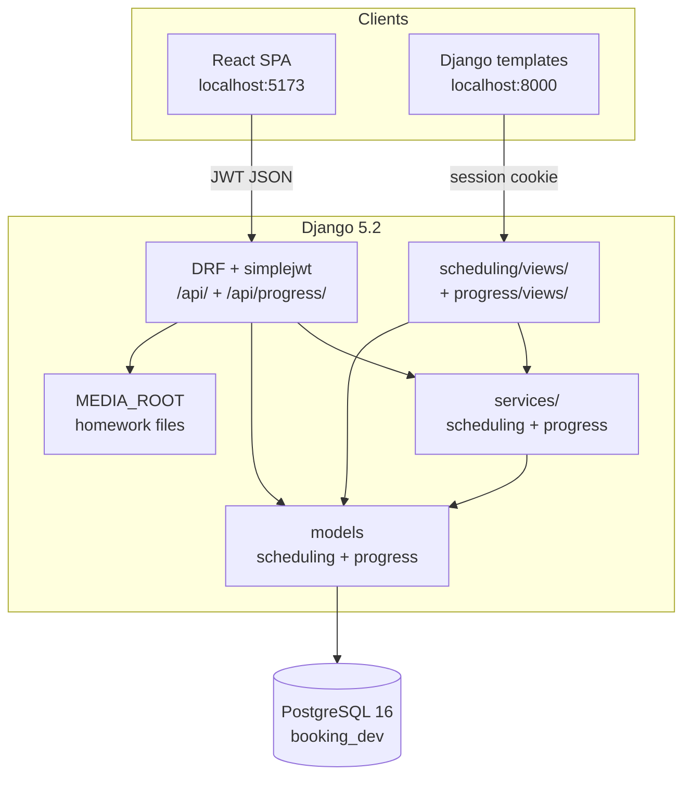
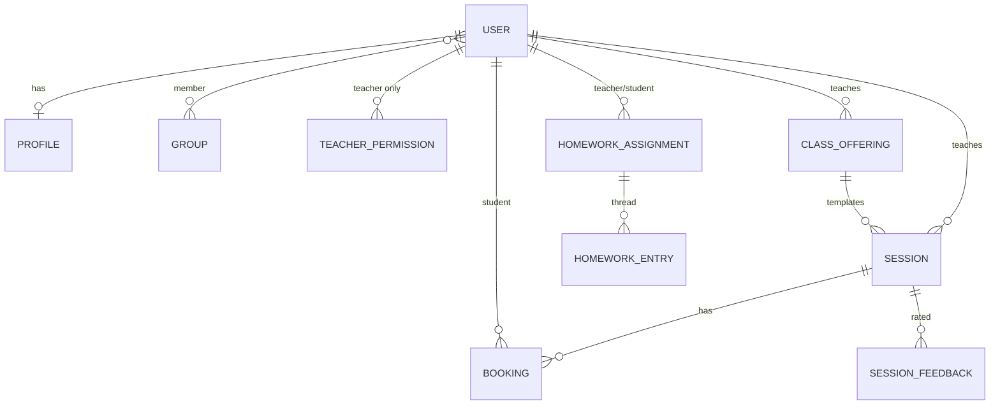

# Architecture & Roadmap

Reference for how the booking app is structured today, where it's headed, and how design decisions fit together.

**Last updated:** 2026-07-06

---

## 1. System architecture — today (sandbox complete)

Dual UI on one Django project + Postgres. Business rules live in `services/`; views and DRF are thin.


```mermaid
flowchart TB
    subgraph clients["Clients"]
        React["React SPA\nlocalhost:5173"]
        HTML["Django templates\nlocalhost:8000"]
    end

    subgraph django["Django 5.2"]
        DRF["DRF + simplejwt\n/api/ + /api/progress/"]
        Views["scheduling/views/\n+ progress/views/"]
        Services["services/\nscheduling + progress"]
        Models["models\nscheduling + progress"]
        Media["MEDIA_ROOT\nhomework files"]
    end

    PG[("PostgreSQL 16\nbooking_dev")]

    React -->|"JWT JSON"| DRF
    HTML -->|"session cookie"| Views
    DRF --> Services
    Views --> Services
    Services --> Models
    DRF --> Models
    Views --> Models
    Models --> PG
    DRF --> Media
```

| Layer | Location | Purpose |
|-------|----------|---------|
| **React SPA** | `frontend/src/` | Primary UI — all role dashboards migrated |
| **DRF API** | `scheduling/api/`, `progress/api.py` | JWT auth for React |
| **HTML UI** | `scheduling/views/`, templates | Legacy/alternate UI (still works) |
| **Services** | `scheduling/services/`, `progress/services.py`, `progress/homework_services.py` | Booking, permissions, metrics, homework rules |
| **Apps** | `scheduling/`, `progress/` | Domain models and migrations |
| **Media** | `media/` (gitignored) | Homework attachments; purged after 7 days |
| **Config** | `config/settings.py`, `.env` | DRF, CORS, JWT, integrations |

**Auth:** Django Groups (`student`, `teacher`, `staff`). React uses JWT; templates use sessions.

---

## 2. Request flow

```text
React page  ──► api.js (JWT)  ──► DRF view  ──► services/  ──► models  ──► Postgres
HTML view   ──► Django view   ──► services/  ──► models  ──► Postgres
```

**Rules:**

1. Views and DRF call `services/` — never duplicate business logic in the client.
2. Templates / React = display only.
3. `POST` for writes; `GET` for lists.
4. Integrations degrade gracefully without env credentials.

---

## 3. Data model — current

### `scheduling` app

| Model | Purpose |
|-------|---------|
| `Profile` | 1:1 with `User` — display name, timezone |
| `ClassOffering` | Teachable catalog entry (subject → level → focus → topic) |
| `ClassType` | Legacy/simple class type (superseded by `ClassOffering` in React) |
| `Session` | Scheduled slot; FK to teacher + `ClassOffering`; capacity, status |
| `Booking` | Student seat in a session |
| `Membership` | Plan gating for students |
| `AvailabilityBlock` | Weekly recurring teacher availability |
| `SpecialAvailability` | One-off availability overrides |
| `TeacherPermission` | Per-teacher capability flags (staff-controlled) |
| `StudioGlossary` | Staff-customizable UI terminology |
| `Message` | Inbox (read-only list in React) |
| `CurriculumItem` | Published curriculum content |
| `BlogPost` | Studio announcements on home page (title, body, optional image) |
| `ClassRequest` | Student-requested class slot; teacher approve/deny; ticket hold rules |
| `StudioBranding` | Sign-in + sidebar display name and logo (staff-editable) |
| `StudioLLMConfig` | Studio-wide LLM provider settings (staff) |
| `DemoItem` | Learning placeholder (admin only) |

### `progress` app

| Model | Purpose |
|-------|---------|
| `SessionFeedback` | Per-session skill scores + notes (JSON `scores`) |
| `ProgressReport` | Legacy rating + note reports |
| `ScoreDimension` | Configurable metric labels (studio-wide, optional per-subject) |
| `Skill` | Optional skill tag on progress reports |
| `HomeworkAssignment` | Teacher → student file exchange or journal prompt |
| `HomeworkEntry` | Thread message; optional attachment (7-day TTL) |

### Relationships (simplified)


```mermaid
erDiagram
  USER ||--o| PROFILE : has
  USER }o--o{ GROUP : member
  USER ||--o{ TEACHER_PERMISSION : "teacher only"
  USER ||--o{ CLASS_OFFERING : teaches
  USER ||--o{ SESSION : teaches
  CLASS_OFFERING ||--o{ SESSION : templates
  SESSION ||--o{ BOOKING : has
  USER ||--o{ BOOKING : student
  SESSION ||--o{ SESSION_FEEDBACK : rated
  USER ||--o{ HOMEWORK_ASSIGNMENT : "teacher/student"
  HOMEWORK_ASSIGNMENT ||--o{ HOMEWORK_ENTRY : thread
```

---

## 4. Roles & permissions

### Django Groups

| Group | Access |
|-------|--------|
| `student` | Book sessions, view progress, homework, membership |
| `teacher` | Manage own schedule/classes/availability; write reports; assign homework (if permitted) |
| `staff` | Studio-wide admin: all teachers, metrics, glossary, user active/inactive |

`User.is_staff` / `is_superuser` → Django `/admin/` only. App staff uses the `staff` Group.

### Teacher capabilities (`TeacherPermission`)

Staff grants or revokes per teacher:

| Key | Label |
|-----|-------|
| `manage_schedule` | Create and schedule sessions |
| `manage_classes` | Create and edit teachable classes |
| `manage_availability` | Edit weekly and special availability |
| `write_reports` | Submit session feedback |
| `assign_homework` | Send files and journal prompts |
| `manage_blog` | Publish home-page announcements and photos |
| `use_ai` | Draft session notes via studio LLM |

Service: `scheduling/services/teacher_permissions.py` — `teacher_can(user, key)`. Staff always passes.

Staff configures the LLM at **Staff → AI settings** (`StudioLLMConfig`).

### Booking gates

| Check | Where |
|-------|-------|
| `can_book` | `scheduling/services/booking.py` |
| `create_booking` | Same — single entry point |
| `cancel_booking` | `scheduling/services/booking.py` |
| Membership active | `scheduling/services/membership.py` |

---

## 5. Repo layout

```text
booking_scheduling_app/
├── config/
│   ├── settings.py          # DRF, CORS, JWT, MEDIA, integrations
│   └── urls.py              # /api/, /api/progress/, media (DEBUG)
├── scheduling/
│   ├── models.py
│   ├── services/            # booking, availability, classes, users, glossary, staff, …
│   ├── views/               # HTML dashboards (package)
│   ├── api/                 # DRF: views, serializers, staff_views, glossary_views
│   ├── templates/
│   └── management/commands/ # bootstrap_sandbox, sync_simplybook
├── progress/
│   ├── models.py
│   ├── services.py          # metrics, feedback, student dashboard
│   ├── homework_services.py # file exchange + journal + purge
│   ├── api.py + api_urls.py
│   ├── views/ + templates/
│   └── management/commands/ # purge_expired_homework
├── integrations/
│   ├── google/meet.py       # placeholder Meet links
│   ├── llm/client.py        # OpenAI / Anthropic / Ollama HTTP client
│   └── simplybook/          # adapter scaffold
├── frontend/src/
│   ├── pages/               # role-specific React pages
│   ├── components/          # SessionDetailPanel, HomeworkThread, …
│   └── hooks/               # useTeacherScope, useGlossary, useScoreDimensions, …
├── docs/
│   ├── architecture-and-roadmap.md   # this file
│   ├── audit-remediation-plan.md     # execution plan (audit + features)
│   ├── glossary.md                   # developer terminology
│   └── learn/                        # CS50P / Django self-study (optional)
├── media/                   # gitignored — homework + blog uploads
└── TICKETS.md               # bug tracker
```

---

## 6. Roadmap — phase status

| Phase | Status | Notes |
|-------|--------|-------|
| 0 — Environment | ✅ | Postgres, venv, Django project |
| 1 — Users & roles | ✅ | Groups, Profile, dashboards |
| 2 — Booking slice | ✅ | Session, Booking, services |
| 3 — Availability | ✅ | Blocks + special availability |
| 4 — Messages & curriculum | ✅ | Inbox + curriculum (read in React) |
| 5 — React + DRF | ✅ | Full SPA migration |
| 6 — Polish | ✅ | Email, calendar, mock payments, deploy config |
| Beyond — scaffolds | ✅ | Google Meet, SimplyBook, `progress/` app |

### Post-sandbox additions (2026)

| Feature | Where |
|---------|-------|
| Staff studio admin | `scheduling/api/staff_views.py`, React staff pages |
| Teacher permission flags | `TeacherPermission` + staff permissions UI |
| CRUD (sessions, classes, feedback, availability) | Teacher + staff APIs; edit/delete in React |
| User active/inactive | `scheduling/services/users.py`, staff student/teacher PATCH |
| Subject-scoped metrics | `ScoreDimension.subject`, staff metrics page (drag reorder, min/max) |
| Studio glossary | `StudioGlossary`, `scheduling/services/glossary.py`, `useGlossary.jsx` |
| Student progress by subject | `student_dashboard()` service, `/api/progress/dashboard/` |
| Homework (files + journal) | `HomeworkAssignment`, `HomeworkEntry`, 7-day file purge |
| Studio LLM + teacher AI permission | `StudioLLMConfig`, `integrations/llm/`, `use_ai` permission |
| Blog announcements | `BlogPost`, `scheduling/services/blog.py`, `BlogFeed`, `BlogManagePage` |
| Class requests | `ClassRequest`, `scheduling/services/class_requests.py`, student request + teacher approval UI |
| Sign-in branding | `StudioBranding`, `GET /api/branding/`, `StaffBrandingPage` |
| Stripe Checkout + webhook | `integrations/stripe/`, mock mode when keys unset |

### Planned (see `docs/audit-remediation-plan.md`)

| Work | Phase | Notes |
|------|-------|-------|
| Audit remediation (security, tests, CI) | 0–15 | High priority before production |
| Cross-teacher **past** session history + privacy | 16 | Student/teacher can hide from peer teachers; staff always see |
| Stripe E2E verify, themes, onboarding, Google Meet | 17–20 | Personal integration + UX polish |
| **Markdown preview** for blog + journal | 22 | Plain textarea + sanitized preview; XSS-safe pipeline |

---

## 7. Staff & studio administration

Staff manage the studio without impersonating Django admin.

| Area | API prefix | React pages |
|------|------------|-------------|
| Teacher list + active/inactive | `/api/staff/teachers/` | `StaffDashboardPage` |
| Per-teacher schedule/classes/availability | `/api/staff/teachers/<id>/…` | `StaffTeacherLayout` + nested routes |
| Teacher permissions | `…/permissions/` | `StaffTeacherPermissionsPage` |
| Studio-wide schedule | `/api/staff/schedule/` | `StaffSchedulePage` |
| Create class for any teacher | `/api/staff/classes/` | `StaffCreateClassPage` |
| Student active/inactive | `/api/staff/students/` | `StaffStudentsPage` |
| Metric names (per subject) | `/api/progress/staff/score-dimensions/` | `StaffMetricsPage` |
| UI terminology | `/api/staff/glossary/` | `StaffGlossaryPage` |

Staff routes mirror teacher APIs under `/api/staff/teachers/<teacher_id>/` so one React page (`useTeacherScope`) works for both teacher self-service and staff acting on a teacher.

---

## 8. Progress, metrics & homework

### Session feedback & metrics

- Teachers rate students per session using configurable **score dimensions** (`ScoreDimension`).
- Studio defaults apply to all subjects; staff can define up to **10 metrics per subject** with custom labels and min/max scores.
- Feedback stored as JSON `scores` on `SessionFeedback` (legacy star columns kept for compatibility).
- API: `/api/progress/feedback/teacher/` (teacher), `/api/progress/feedback/` (student charts).

### Student progress dashboard

- `GET /api/progress/dashboard/` — progress grouped **by subject**.
- Per subject: metrics, feedback history, classes taken, session list.
- React: `StudentProgressPage` with subject tabs and charts (recharts).

### Homework

Two assignment kinds — each is tied to **one session** the student is booked on (one homework per student per session):

| Kind | Behavior |
|------|----------|
| `file` | Teacher/student exchange files in a thread; uploads expire **7 days** after upload; thread closes after 7 days |
| `journal` | Teacher sends a text prompt after a session; student adds journal entries (text only, kept indefinitely) |

- Files served via authenticated download: `/api/progress/homework/entries/<id>/download/`
- Purge: automatic on list views + `python manage.py purge_expired_homework`
- Permission: `assign_homework` teacher flag
- React: `TeacherHomeworkPage`, `StudentHomeworkPage`, `HomeworkThread` component

**Content format today:** blog body, journal entries, and homework messages are **plain text** (rendered as text in React — no raw HTML). See §15.

### Studio blog

- Staff/teachers with `manage_blog` publish announcements on the home page.
- API: `GET /api/blog/`, staff manage `GET/POST /api/blog/manage/`, image upload with size limits.
- React: `BlogFeed` (home), `BlogManagePage` (authoring).
- **Planned (Phase 22):** Markdown authoring with sanitized preview below the textarea.

### Class requests

- Students request a class during teacher availability; teacher approves or denies.
- Ticket hold on request; refund rules differ from normal booking cancel after approval.
- Service: `scheduling/services/class_requests.py`; React: `StudentRequestClassPage`, `TeacherClassRequestsPage`.

### Studio branding

- Staff set display name + logo for sign-in and sidebar.
- Public `GET /api/branding/`; staff `PATCH /api/staff/branding/`.
- React: `useBranding`, `StaffBrandingPage`.

### Studio AI (LLM)

- Staff configures provider (OpenAI, Anthropic, Ollama, OpenAI-compatible), API key, model, and studio on/off.
- API keys stored server-side; API returns masked key only.
- Teachers need `use_ai` permission (staff-controlled per teacher).
- First feature: **Suggest notes with AI** on session feedback (`POST /api/teacher/ai/suggest-feedback/`).
- Client: `integrations/llm/client.py` (stdlib HTTP, no SDK dependency).

---

## 9. API surface (React / JWT)

### `scheduling` — `/api/`

| Area | Key paths |
|------|-----------|
| Auth | `auth/token/`, `auth/token/refresh/` |
| Account | `me/`, `me/password/` |
| Glossary | `glossary/` (read), `staff/glossary/` (staff edit) |
| Student | `sessions/open/`, `bookings/`, `membership/` |
| Teacher | `teacher/sessions/`, `teacher/classes/`, `teacher/availability/`, `teacher/permissions/` |
| Shared | `messages/`, `curriculum/` |
| Staff | `staff/teachers/`, `staff/students/`, `staff/schedule/`, `staff/classes/`, `staff/teachers/<id>/…`, `staff/branding/` |
| Blog | `blog/`, `blog/manage/` |
| Class requests | `class-requests/` (student), `teacher/class-requests/` |
| Branding | `branding/` (public read) |

### `progress` — `/api/progress/`

| Area | Key paths |
|------|-----------|
| Student | `/`, `dashboard/`, `feedback/`, `homework/` |
| Teacher | `feedback/teacher/`, `homework/teacher/` |
| Metrics | `score-dimensions/` |
| Staff | `staff/score-dimensions/`, `staff/teachers/<id>/feedback/`, `staff/teachers/<id>/homework/` |

Browsable API: http://127.0.0.1:8000/api/

---

## 10. Integrations & deploy

| Integration | Status | Config |
|-------------|--------|--------|
| Google Meet | Placeholder link | `GOOGLE_*` env |
| Stripe | Mock purchase | `STRIPE_SECRET_KEY` |
| SimplyBook | Inert adapter | `SIMPLYBOOK_API_KEY` |
| Email | Console in dev | `EMAIL_HOST` for SMTP |

Deploy: `docker compose up --build`, or `Procfile` + gunicorn. WhiteNoise serves static files; **homework media** needs a volume or object storage in production (WhiteNoise does not serve `MEDIA_ROOT`).

---

## 11. Target product flow (future refactor)

**Today:** teacher creates `Session` from `ClassOffering` catalog → student books.

**Target:** availability + catalog → student picks slot + class → session born on first booking.

See original design notes below — still valid for Phase 3–4 refactor of *who* creates sessions.

```text
TEACHER SETUP
  AvailabilityBlock + ClassOffering catalog

STUDENT BOOKS
  Pick class + open session → create_booking() checks membership, capacity, duplicates

CANCEL
  cancel_booking() — session stays if other bookings remain
```

| Phase 2 (built) | Target (later) |
|-----------------|----------------|
| Teacher `SessionForm` | Availability-driven slot picker |
| `can_book` (group, capacity) | + availability window, plan type |
| `Session` teacher-created | Option A: session on first booking |

---

## 12. External systems (SimplyBook) — future

Postgres is the source of truth. SimplyBook maps in via `integrations/simplybook/` when credentials exist; `external_id` fields on models support idempotent sync. Do not shape core schema around export columns.

---

## 13. Decisions log

| Topic | Decision |
|-------|----------|
| Frontend | React primary; templates retained |
| Roles | Django Groups + per-teacher `TeacherPermission` flags |
| Class catalog | `ClassOffering` (subject/level/focus/topic); session title from catalog |
| Metrics | Studio `ScoreDimension`; optional per-subject scope; max 10 active |
| Glossary | `StudioGlossary` — staff renames UI terms (student→client, etc.) |
| Homework files | 7-day TTL; journal text kept; auth-gated download |
| User-generated content | Plain text only today; Markdown + bleach planned (Phase 22) |
| `can_book` / `create_booking` | `scheduling/services/booking.py` |
| SimplyBook | Adapter only; clean domain models |

---

## 14. User-generated content & XSS

Blog posts, journal entries, homework messages, and session notes are stored as **plain text** and displayed in React as text nodes (not `dangerouslySetInnerHTML`). That avoids **XSS (Cross-Site Scripting)** — user-supplied markup cannot run as JavaScript in another member’s browser.

JWT tokens live in `localStorage` in the React app, so XSS would be especially dangerous (stolen tokens). The audit remediation plan (Phases 5, 22) covers CSP headers and a safe formatting path.

### Planned: Markdown with sanitized preview (Phase 22)

| Layer | Approach |
|-------|----------|
| **Authoring** | Plain `<textarea>`; live **preview panel below** (not WYSIWYG) |
| **Storage** | Same `TextField` — store Markdown source, not rendered HTML |
| **Render** | Server: `markdown` → **bleach** allowlist → safe HTML for API `body_html` or on read |
| **Preview** | Client: optional live preview with same rules; server sanitizes on save |
| **Scope** | `BlogPost.body`, `HomeworkEntry.body`, journal prompts display |

Shared helper (planned): `scheduling/services/markdown.py` or `progress/markdown.py` — one pipeline for preview, save, and feed display.

---

## 15. Documentation map

### Project (day-to-day)

| Doc | Purpose |
|-----|---------|
| [`architecture-and-roadmap.md`](./architecture-and-roadmap.md) | This file — system design & roadmap |
| [`glossary.md`](./glossary.md) | Developer terminology |
| [`audit-remediation-plan.md`](./audit-remediation-plan.md) | Phased audit fixes + feature work (0–22) |
| [`future-features.md`](./future-features.md) | Post-audit ideas + Cursor prompts per feature |
| [`audit_instructions.md`](./audit_instructions.md) | Full-stack audit checklist |
| [`cursor_ruleset.md`](./cursor_ruleset.md) | Agent propose-before-apply workflow |
| [`next-session-handoff.md`](./next-session-handoff.md) | Short reference for Part B tasks |
| `CLAUDE.md` | AI assistant quick reference |
| `TICKETS.md` | Open bugs and polish |

### Learning (optional)

| Doc | Purpose |
|-----|---------|
| [`learn/README.md`](./learn/README.md) | Index of self-study materials |
| [`learn/LEARN_DJANGO.md`](./learn/LEARN_DJANGO.md) | 5-week Django course on this repo |
| [`learn/django-vs-crud-project.md`](./learn/django-vs-crud-project.md) | Reflet → Django map |
| [`learn/postgres-roles-membership-inheritance.md`](./learn/postgres-roles-membership-inheritance.md) | DB roles vs app users |
| [`learn/future-student-progress-app.md`](./learn/future-student-progress-app.md) | Original progress plan (historical) |
